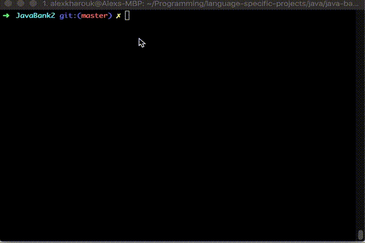
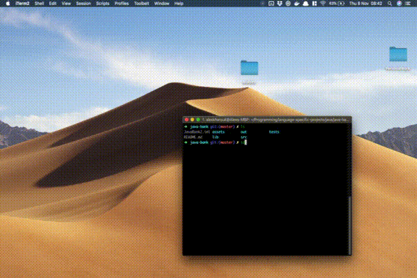

# Welcome to JavaBank Inc!

A bank transfer system written entirely in Java. Was built in around two days and my primary focuses were to improve my Object Oriented Design as well using Test-Driven Development to create an application in a language I barely know.

### A blog post regarding this project can be found [here](https://kharouk.github.io).

## Try It Without Downloading Anything:
### A live demo is available: https://repl.it/@Kharouk/JavaBank

Just press **run**.


## Getting Started
These instructions will get you a copy of the project up and running on your local machine for development and testing purposes. Due to the project being a Java application, there are a few prerequisites if you've never launched a Java program on your computer.


## Prerequisites
1. Check if you have Java installed. If not, follow the instructions to download Java [here][1].
```
$ java
```
2. Once Java is installed/already installed, try running `java` in your console again.
3. If you see a bunch of info regarding using Java, you're ready.

## Setting Up
Time to get the app on your computer! 

1. Let's clone the project:
```bash
$ git clone https://github.com/Kharouk/java-bank.git
$ cd java-bank
```

2. Head to the package directory:
```bash
$ cd out/production/JavaBank2/
```

3. If you list inside the directory, you should see:
```bash
$ ls
>> META-INF com
```
4. You're all set up! Now to run the application: 
```bash
$ java com.javabanktech.Main
```
5. This launches the Main class of the program. Hopefully, you'll see this:
  

Tests
---
Used JUnit 5 as well as Mockito to Test Drive the code. Test files are located at:
```bash
cd out/test/JavaBank2/com/javabanktech
```
If you want to run the tests, open up the files in an IDE like IDEA or a text editor like VSCode:
  

Requirements as a Technical Challenge
---
This project was simulated to be like a Technical Challenge. Here was the criteria given in solving this challenge:

- [x] You should be able to interact with your code via a REPL like IRB or the JavaScript console.  (You don't need to implement a command line interface that takes input from STDIN.)

- [x] Deposits, withdrawal.

- [x] Account statement (date, amount, balance) printing.

- [ ] Data can be kept in memory (it doesn't need to be stored to a database or anything).

**Given** a client makes a deposit of 1000 on 10-01-2012  
**And** a deposit of 2000 on 13-01-2012  
**And** a withdrawal of 500 on 14-01-2012  
**When** she prints her bank statement  
**Then** she would see:

```
date || credit || debit || balance
14/01/2012 || || 500.00 || 2500.00
13/01/2012 || 2000.00 || || 3000.00
10/01/2012 || 1000.00 || || 1000.00
```
## Built With

* [IDEA](https://www.jetbrains.com/idea/) - The IDE Used
* [Repl.it](https://repl.it) - Live Demo/Quick Feature Testing
* [JUnit](https://junit.org/junit5/) - Testing Framework

## Acknowledgments

* Hat tip to Makers for providing the technical test
* To the many developers who explain Java a lot better than the docs

[1]: https://www.java.com/en/download/help/download_options.xml